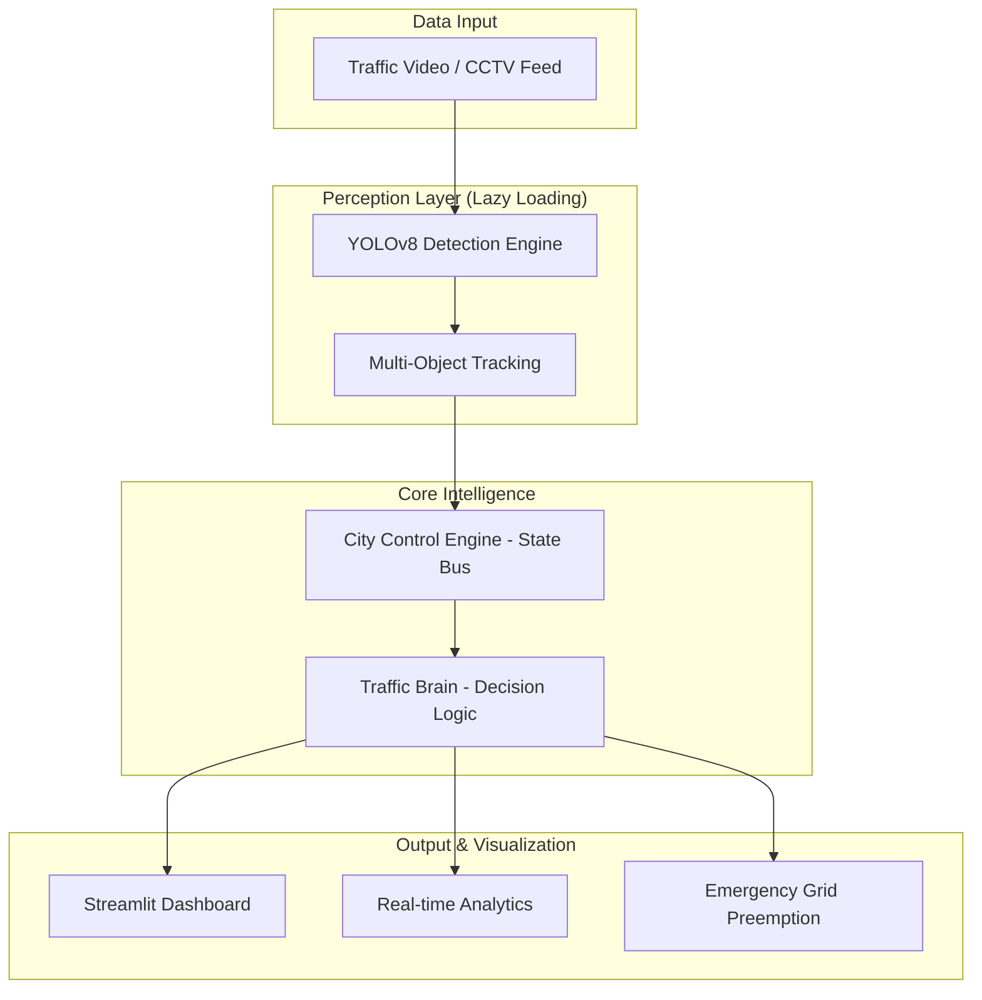

# 🚦 UrbanFlow AI - Smart City Traffic Intelligence Platform

[](https://trafficsafegit-wwavjrskzewqkbyn768ama.streamlit.app/)

UrbanFlow AI is a next-generation traffic management system that leverages Computer Vision and AI-driven heuristics to optimize urban mobility. Designed for the **Hackathon 2024**, this platform demonstrates real-time vehicle tracking, congestion analysis, and emergency vehicle preemption.

---

## 🚀 Hackathon Demonstration Mode
For the purpose of evaluation, all authentication barriers have been removed. The dashboard is immediately accessible with a permanent **"Hackathon Demonstration Mode"** banner.
- **Direct Access**: No login required.
- **Pre-loaded Context**: Real-time mobility scores and system health metrics are initialized automatically.

---

## 🏗️ System Architecture



---

## 🔍 Core Features

### 1. AI-Powered Perception
- **Vehicle Detection**: Real-time detection of Cars, Bikes, Buses, Trucks, and Autos using YOLOv8.
- **Lazy Loading Strategy**: The AI model is only loaded into RAM when needed, ensuring the base application runs efficiently on low-resource environments (Streamlit Cloud).
- **Trajectory Tracking**: Unique ID persistence across frames to monitor flow.

### 2. Intelligent Traffic Control
- **Traffic Density Scoring**: Weighted scoring system (Buses/Trucks > Cars > Bikes) to calculate true intersection load.
- **Emergency Priority (Green Corridor)**: Specialized heuristics to detect ambulances/fire trucks and automatically force signal overrides along their projected route.
- **Urban Mobility Index**: A consolidated score representing the health of the city's traffic flow.

### 3. Interactive Analytics
- **Live Heatmaps**: Spatial distribution of traffic intensity.
- **Violation Monitor**: Automated logging of red-light jumps and rash driving.
- **System Health Panel**: Real-time monitoring of AI model performance and detection latency.

---

## 🛠️ Tech Stack & Deployment

- **Frontend**: Streamlit (Python)
- **Computer Vision**: OpenCV, Ultralytics YOLOv8
- **Language**: Python 3.10+
- **Deployment**: Streamlit Cloud (Optimized)

### Deployment Optimizations
- **Headless Environment**: Fully compatible with `opencv-python-headless` to eliminate system library conflicts.
- **Resource Management**: Lazy model initialization to stay under the 1GB RAM threshold.
- **Debug Instrumentation**: Integrated logging markers to monitor boot sequence.

---

## ▶️ Setup & Installation

1. **Clone the Project**
   ```bash
   git clone https://github.com/ashwinikanamareddy/traffic_safe.git
   cd traffic_safe
   ```

2. **Install Dependencies**
   ```bash
   pip install -r requirements.txt
   ```

3. **Run Locally**
   ```bash
   streamlit run app.py
   ```

---

## 📄 License & Author
**Author**: Ashwini Kanamareddy
**Project**: Traffic Intelligence System – Hackathon Submission

---

## 🏆 Conclusion
UrbanFlow AI demonstrates how modern computer vision can transform "seeing traffic" into "understanding mobility," providing city planners and emergency responders with the tools needed for a safer, smarter urban future.
